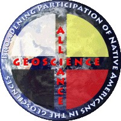

# About us 

We are an interdisciplinary, multi-institutional collaboration with the goal to increase equitable access to earth and environmental data science graduate pathways for Native American students. Our project involves developing, testing, and supporting culturally-centered environmental data science curriculum for classrooms, labs, and workshops via online modules and educational resources.   

**Our collaboration includes:**

{width=25%}

The Ecological Forecasting Initiative (EFI) is a grassroots consortium aimed at building and supporting an interdisciplinary community of practice around near-term (daily to decadal) ecological forecasts. Visit the [Ecological Forecasting Initiative website](https://ecoforecast.org/), and check out EFI's compilation of educational resources [here](https://ecoforecast.org/resources/educational-resources/).

<left>
{width=25%}
</left>

[Geoscience Alliance](https://geosciencealliance.org/) is a national alliance of individuals committed to broadening the participation of Native Americans, Alaska Natives, and people of Native Hawai’ian ancestry in the geosciences. 

Native Food Energy Water Systems 

 - Jason McLachlan, University of Notre Dame 
 - Jody Peters, University of Notre Dame 
 - Nievita Bueno Watts, Cal-Poly Humboldt 
 - Diana Dalbotten, University of Minnesota
 - Georgia Smies, Salish Kootenai College
 - Melissa Kenney, University of Minnesota
 - Al Kuslikis, American Indian Higher Education Consortium
 - Antionette Abeyta, University of New Mexico, Gallup
 - Sean Dorr, University of Minnesota 
 
**Contact us**

Interested in learning more or getting involved? Want to use material, host a workshop, or collaborate on new material? Contact us!

Contact Dr. Rachel Torres at Rachel.Torres@humboldt.edu 

 
**Support**

This project is supported by funding from the Alfred P. Sloan Foundation. 
 
