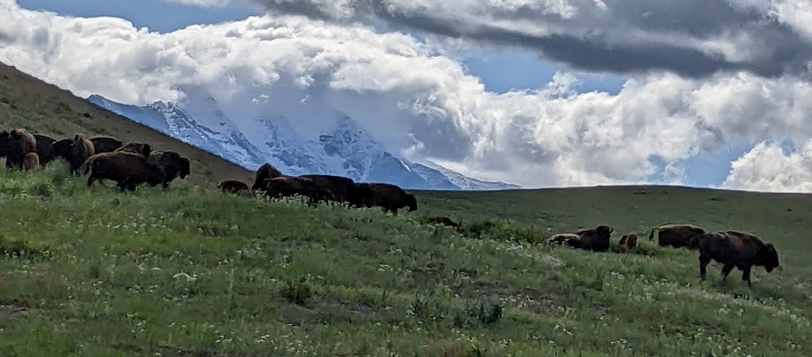

# Welcome: Indigenous Environmental Data Science with R 



</br> 

We are an interdisciplinary group of scientists and educators developing culturally-aware environmental data science modules for undergraduate classrooms and workshops. We are looking to grow our earth and environmental data sciences community and to support undergraduate Indigenous students through mentorship, research opportunities, and preparation for graduate programs.  

All of our material can be found on our [github organization](https://github.com/IndigenousEnvDataSci) as different repositories. If you are familiar with github, feel free to fork a repository to modify or use the material. If you are not familiar with github, you can download the source code for your own use ([instructions on how to do that here](https://docs.github.com/en/get-started/start-your-journey/downloading-files-from-github)). 

```{tableofcontents}
```